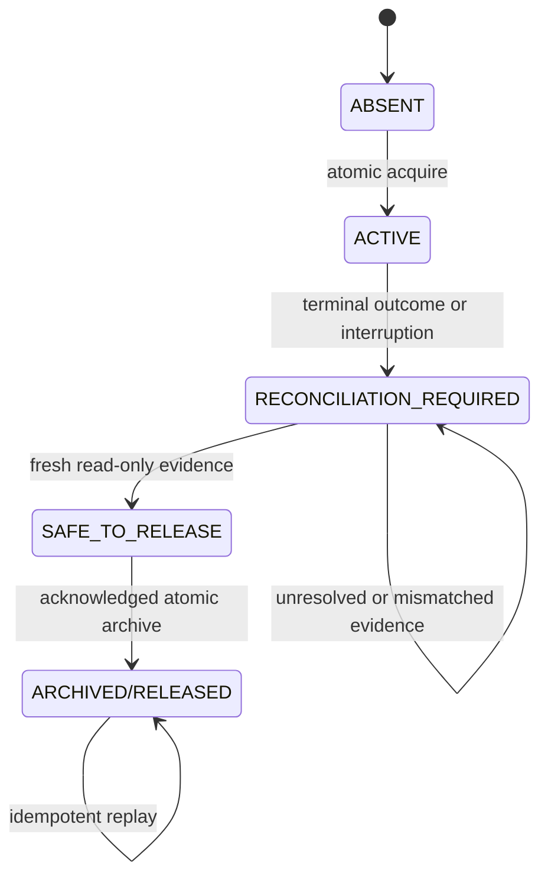
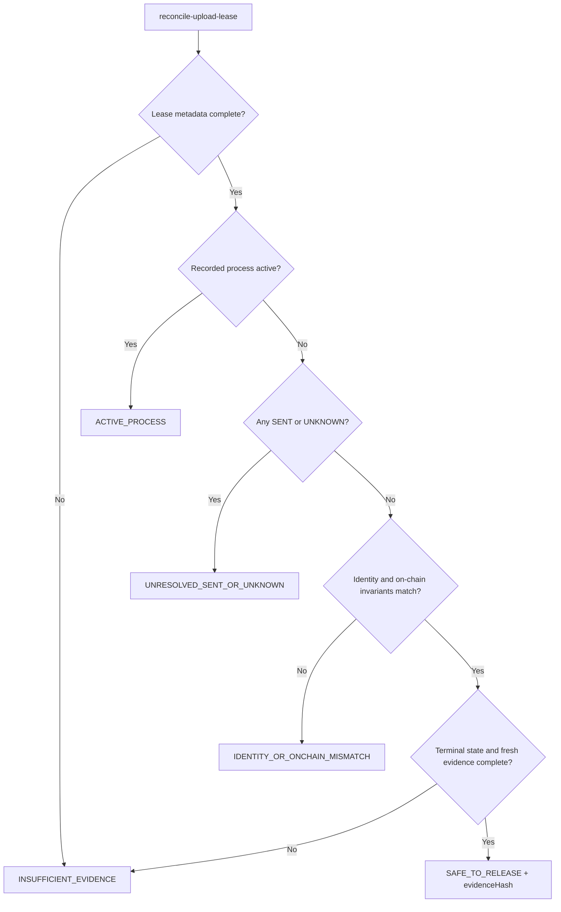
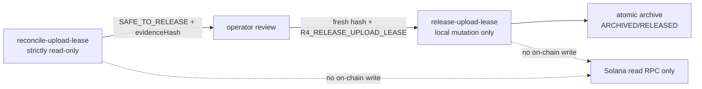

# R4A Bounded Devnet Upload Gate Design

This document explains the approved R4A contract. Tests and implementation are
the source of truth if this explanation ever conflicts with them.

## Scope and fixed policy

R4A publishes, but does not execute, `upload-buffer-throttled`. The command
accepts only the canonical devnet RPC, program, preserved buffer, ignored state
path, ignored authority path, `maxChunks <= 5`, `delayMs >= 1000`, and the
literal acknowledgement `R4_BUFFER_UPLOAD`. Concurrency is exactly one. The
first 429, confirmed failure, byte mismatch, or `UNKNOWN` stops the window.
There is no automatic resend, replacement, close, regeneration, or finalize.

The live command validates all read-only invariants and acquires a local lease
before loading a signer or fetching a blockhash. It persists the locally
derived public signature as `SENT` before sending the exact signed transaction.
It leaves the lease for explicit reconciliation and release after every window.

## Lease storage and lifecycle

The active lease is an ignored directory derived from the explicit state path.
Atomic directory creation provides contention exclusion. Its `lease.json`
contains only public execution ID, PID, hostname, start time, canonical
identities, plan fingerprint, and state SHA-256 at acquisition. A partial lease
after interruption is insufficient evidence and remains fail-closed.

Actual public lifecycle labels are `ABSENT`, `ACTIVE`,
`RECONCILIATION_REQUIRED`, `SAFE_TO_RELEASE`, and `ARCHIVED/RELEASED`.
Lease age alone never advances the lifecycle.

## Reconciliation decision flow

`reconcile-upload-lease` is strictly read-only. It validates the active lease,
schema-v3 state, state/lease identities, full current state hash, terminal
window evidence, every `SENT` or `UNKNOWN` record, canonical program absence,
and preserved buffer metadata and bytes. It returns a sanitized deterministic
`evidenceHash` over the fresh evidence.

`release-upload-lease` requires the exact execution ID, fresh reconciliation
hash, and acknowledgement `R4_RELEASE_UPLOAD_LEASE`. It recomputes all evidence
instead of trusting prior output. Any active process, unresolved transaction,
identity mismatch, on-chain mismatch, state-hash drift, or stale hash fails
closed. After persisting a sanitized terminal outcome, it atomically renames
the active lease directory into ignored history. It never deletes the audit
record. A matching archived record makes replay idempotently successful.

## Separation of authority

Neither lease command loads a signer, fetches a blockhash, sends or simulates a
transaction, or changes an on-chain account.

## State-v3 migration boundary

`inspect-state-migration` reads an explicit ignored state file and returns only
current/target schema, migration necessity, and a sanitized structural summary.
`migrate-state-v3` is a separate local-only command requiring exact canonical
identity, buffer, allocation, binary length/hash, ignored-path validation, and
`R4_MIGRATE_STATE_V3`. It creates a collision-safe backup, atomically replaces
the state, rereads and validates it, and rolls back from the preserved backup
if validation fails. Re-running valid v3 state performs no write. R4A exercises
this only with synthetic or copied fixtures; real `.devnet/state.json` stays v2.

Schema v3 adds immutable plan evidence, chunk records, and sanitized upload
window outcomes. No secret path, signer bytes, raw signed transaction, mnemonic,
or raw subprocess/RPC output may be stored.

## Live execution ordering

The production entrypoint performs: explicit contract validation; exact
devnet/genesis attestation; program absence and buffer validation; binary/plan
validation; fresh funding calculation with the 250,000,000-lamport reserve;
atomic lease acquisition; reconciliation of existing uncertain records; exact
nonmatching chunk selection; then one-at-a-time blockhash, build, sign,
persist-`SENT`, send, bounded confirmation, full-chunk reread, persist
`CONFIRMED`, and minimum delay. It persists a sanitized window outcome and
leaves release to the two-command reconciliation protocol above.

## Verification boundary

Local tests use injected clocks and test-only identities while retaining the
production minimum delay and five-chunk policy. The only permitted live R4A
operation is a read-only preflight after all focused tests pass. Publication
requires full local verification and terminal Ubuntu CI success for the exact
published SHA. R4A performs zero devnet writes and never migrates real state.
