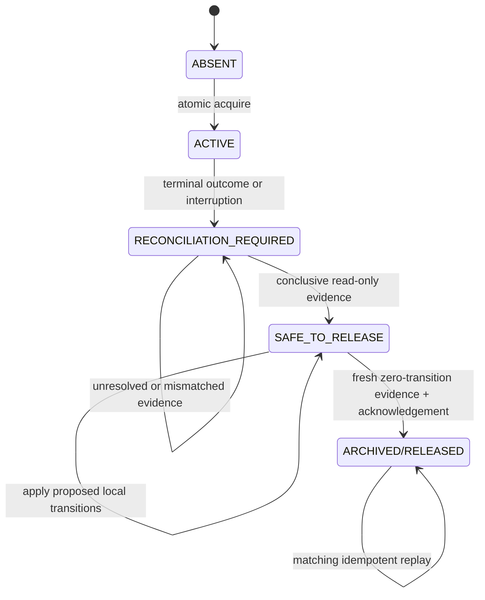
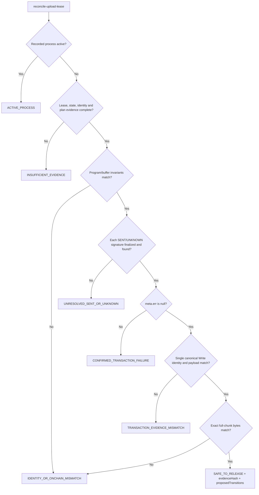
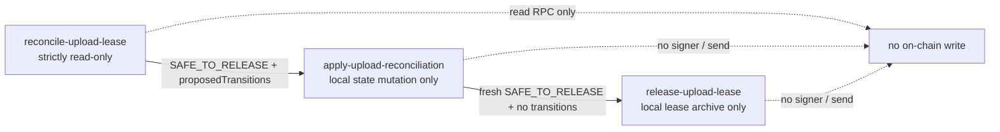

# R4B-R1 Reconciliation Recovery Design

This document explains the approved R4B-R1 recovery contract. Tests and the
implementation are authoritative if this explanation ever conflicts with
them.

## Scope and boundary

R4B-R1 corrects the public read-only reconciliation path and adds one explicit
local state-recovery command. It may query devnet for finalized public
transaction and account evidence, but it never loads a signer, fetches a
blockhash, simulates, sends, deploys, closes, or replaces anything on-chain.
The real `.devnet/state.json` and active lease remain byte-for-byte unchanged
during this phase; mutation tests use only synthetic or copied fixtures.

## Conclusive transaction evidence

For every local `SENT` or `UNKNOWN` chunk, reconciliation reads the recorded
public signature and proves all of the following before proposing
`CONFIRMED`: finalized status, `meta.err === null`, exact transaction
signature, exactly one canonical upgradeable-loader `Write` instruction,
canonical buffer and authority accounts, authority signer role, exact planned
offset and payload hash/length, and exact full-chunk bytes in the preserved
buffer. Program and buffer accounts are read in one finalized contextual
snapshot at or after the transaction slot. Program absence, buffer
owner/authority/allocation, binary
length/SHA-256, chunk-plan coverage, and plan fingerprint must also remain
unchanged. Missing or ambiguous proof fails closed.

The read-only result contains `preStateSha256`, `leaseSha256`, a deterministic
`onchainEvidenceFingerprint`, verified public signature/slot/fee facts, and
exact `proposedTransitions`. Its `evidenceHash` binds those values plus the
execution ID, canonical identities, allocation, binary hash, plan fingerprint,
terminal upload-window outcome, and normalized transaction evidence.

## Lease lifecycle

Actual public lifecycle labels remain `ABSENT`, `ACTIVE`,
`RECONCILIATION_REQUIRED`, `SAFE_TO_RELEASE`, and `ARCHIVED/RELEASED`. Lease age
alone never changes a result. `SAFE_TO_RELEASE` with non-empty
`proposedTransitions` is safe evidence for local reconciliation application,
but is deliberately not release-ready.

## Reconciliation decision flow

## Separation of authority

`apply-upload-reconciliation` requires the exact fresh evidence hash and
`R4_APPLY_UPLOAD_RECONCILIATION`. It recomputes evidence immediately, requires
unchanged state and lease hashes, changes only the listed `SENT/UNKNOWN ->
CONFIRMED` records, and appends a sanitized outcome to the matching upload
window. The state replacement is atomic, reread and validated, with atomic
rollback on failure. An exact already-applied evidence record is an idempotent
no-op; unmatched replay, stale evidence, or drift is rejected.

A stored apply receipt is never trusted by shape alone. Post-apply
reconciliation re-queries every receipt-listed finalized transaction,
reconstructs the canonical pre-apply state, requires the transitions to equal
that state's complete `SENT/UNKNOWN` set, verifies `stateSha256Before`, and
recomputes the prior evidence hash and on-chain fingerprint. Partial and decoy
receipts therefore fail closed.

`release-upload-lease` refuses every reconciliation result with non-empty
`proposedTransitions`. Only a fresh post-apply, zero-transition evidence hash
plus `R4_RELEASE_UPLOAD_LEASE` can atomically archive the lease. Apply never
archives the lease, and release never edits upload state. Apply and release use
the same `${statePath}.upload-lease-operation-lock`. Release writes an exact
`SAFE_TO_ARCHIVE` audit receipt atomically inside the active lease directory
before the single active-to-archive directory rename. A failed rename leaves
the active lease and audit receipt intact for a matching idempotent retry.

## Sanitized failure contract

The CLI emits only stable structured failure classifications. HTTP/RPC 429,
including nested response bodies and headers, becomes
`{"code":"RPC_RATE_LIMITED","retryable":false,"terminal":true}`. Other
failures become a stable non-secret classification. Raw RPC bodies, endpoint
credentials/query strings, request IDs, serialized transactions, secret paths,
key arrays, and mnemonic-like text are never copied into public output.
Long public `skippedIndexes` arrays are accepted only as part of the exact
validated uploader-result schema; arbitrary byte-array-shaped values remain
rejected.

## R4B-R1 live read-only checkpoint

The single approved public reconciliation returned `SAFE_TO_RELEASE` with one
proposal, `chunk 222: SENT -> CONFIRMED`, and `releaseReady: false`. Its
evidence hash is
`76f6e6e6d953751d754aae691c939139bb4ef3921ca4c0caa079eb2edc1daa3e`.
Before/after snapshots proved unchanged state and lease hashes/mtimes, authority
balance, 224-entry buffer history fingerprint, program absence, and buffer
owner, authority, allocation, lamports, and full data hash. No real apply or
release was performed.
